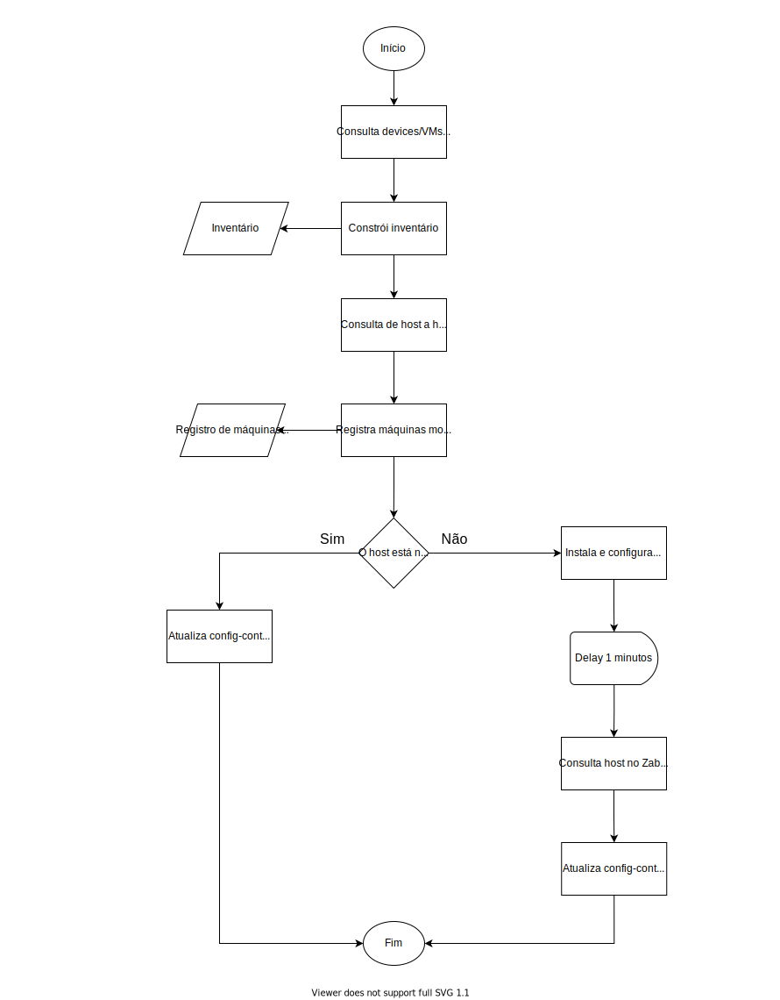

# Netbox-sync
 
## Description 
A função desse projeto é a sincronização de hosts entre o Netbox e Zabbix.  O Netbox é usado como fonte de verdade, trazendo as informações dos hosts presentes na ferramenta para que sejam monitoradas através da plataforma Zabbix. Utilizamos a ferramenta Ansible para automatizar o processo de sincronização.  

Este módulo utiliza as seguintes ferramentas:
  
- Netbox - Responsável pela origem dos dados (Fonte da verdade); 
- Ansible - Responsável por sincronizar o Zabbix com as informações do Netbox; 
- Zabbix - Ferramenta de monitoramento.   


| Ansible | Netbox | Zabbix  |
|:---:|:---:|:---:|
|  |  |  |
| [Documentação Ansible](https://docs.ansible.com/ansible_community.html) | [Documentação Netbox](https://netbox.readthedocs.io/en/stable/)  | [Documentação Zabbix](https://www.zabbix.com/documentation/current/en) |

### The big picture


#### Visual

Asciinema and images screenshots

#### Dependências 
 - [Zabbix-api](https://www.zabbix.com/documentation/current/pt/manual/api).
 - [Pynetbox](https://pypi.org/project/pynetbox/)

```
pip3 install zabbix-api
pip3 install pynetbox
git clone repo
```

#### Usage


asfaslkfjalksdjflsadf

#### Support

asfaslkfjalksdjflsadf

#### Roadmap

asfaslkfjalksdjflsadf

#### Contribute

asfaslkfjalksdjflsadf

#### Authors and acknowledgement

Esse script foi desenvolvido pelos membros da Gole, que são responsáveis pela manutenção e atualização do projeto. Caso haja interesse em contribuir para o desenvolvimento do projeto, consulte o tópico “Contribute” neste mesmo documento.

Integrantes:

Maurício Santana Gonçalves - @nemmeviu <br>
Maria Aline Ferreira de Lima - @MariaAline26 <br>
Murilo Pedroso Braga - @murilopedrosobraga <br>
Liara Assad Macool - <a href="https://www.linkedin.com/in/liara-assad-macool-87375215/" target="_blank">LinkedIn</a>

#### License

alskdjfakjsdf

#### Project Status

O projeto atualmente tem suas funcionalidades atreladas a conexão com o Zabbix, naturalmente, com o avanço do desenvolvimento novos módulos de sincronização serão adicionados à plataforma, buscando abranger um maior número de possibilidades.
